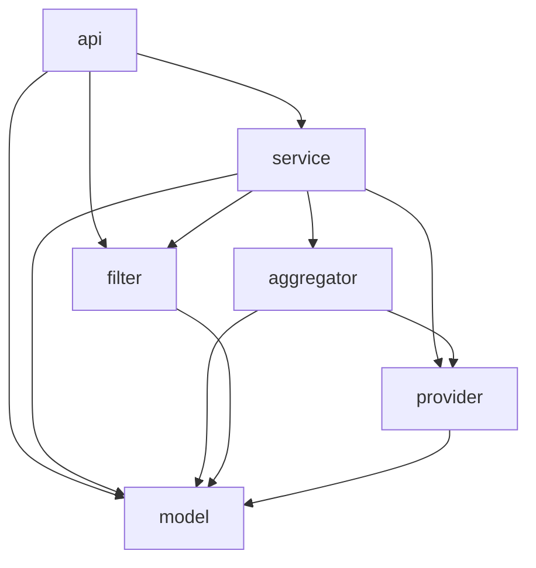
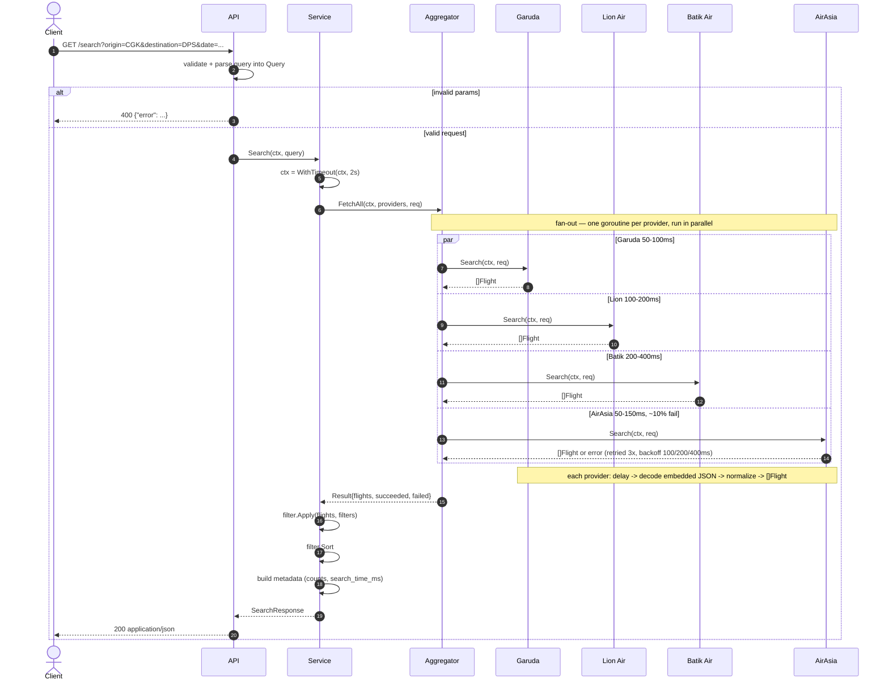

# Flight Search & Aggregation System

Aggregates flights from four mock airline providers (Garuda Indonesia, Lion Air,
Batik Air, AirAsia) — each with a different JSON shape — into one normalized,
filterable, sortable, ranked result set, served over HTTP.

Go 1.26+, standard library only, no external dependencies.

---

## Quick setup

**1. Install Go 1.26+** — the only prerequisite.

- Download the official installer from <https://go.dev/dl/>, or use a package manager:
  - **macOS:** `brew install go`
  - **Windows:** `winget install GoLang.Go` (or `choco install golang`)
  - **Linux:** download the tarball and extract to `/usr/local`, then add
    `/usr/local/go/bin` to your `PATH`:
    ```bash
    curl -LO https://go.dev/dl/go1.26.0.linux-amd64.tar.gz
    sudo rm -rf /usr/local/go && sudo tar -C /usr/local -xzf go1.26.0.linux-amd64.tar.gz
    export PATH=$PATH:/usr/local/go/bin   # add to ~/.bashrc or ~/.profile to persist
    ```
- Verify: `go version` should print `go1.26` or newer.

**2. Clone, test, and run:**

```bash
git clone git@github.com:zakidevara/bookcabin-assessment.git
cd bookcabin-assessment          # the folder containing go.mod

go test ./...                    # run the test suite
go build ./... && go vet ./...   # compile + static checks
go run ./cmd/server              # start the HTTP API on :8080
go run ./cmd/server -demo        # instead: one sample search, print JSON, exit
go run ./cmd/server -addr :9000  # custom port
```


## HTTP API

### `GET /search`

All parameters are query-string values.

| Parameter | Required | Default | Description |
|---|---|---|---|
| `origin` | Yes | — | Origin airport code, e.g. `CGK`. |
| `destination` | Yes | — | Destination airport code, e.g. `DPS`. |
| `date` | Yes | — | Departure date, `YYYY-MM-DD`. |
| `passengers` | No | `1` | Positive integer. |
| `cabin` | No | `economy` | Cabin class. |
| `sort` | No | `best_value` | One of `best_value`, `price_asc`, `price_desc`, `duration_asc`, `duration_desc`, `depart_asc`, `arrive_asc`. |
| `min_price` | No | — | Minimum price, IDR. |
| `max_price` | No | — | Maximum price, IDR. |
| `max_stops` | No | — | Maximum number of stops (`0` = direct only). |
| `max_duration` | No | — | Maximum total duration, in minutes. |
| `airlines` | No | — | Comma-separated airline codes or names, e.g. `GA,JT`. |

**Responses**

| Status | Body | When |
|---|---|---|
| `200 OK` | `SearchResponse` (below) | Success — even if some providers failed (see `metadata`). |
| `400 Bad Request` | `{"error":"..."}` | Missing or invalid parameters. |
| `405 Method Not Allowed` | `{"error":"..."}` | Any method other than GET. |

The request context is threaded through, so a dropped connection cancels the
search; the server drains in-flight requests on SIGINT/SIGTERM.

**Example requests**

```bash
# default (best-value ranking)
curl "localhost:8080/search?origin=CGK&destination=DPS&date=2025-12-15"

# shortest first, direct only, under Rp1.3M, Garuda only
curl "localhost:8080/search?origin=CGK&destination=DPS&date=2025-12-15&sort=duration_asc&max_stops=0&max_price=1300000&airlines=GA"
```

**Sample response**:

```json
{
  "search_criteria": {
    "origin": "CGK",
    "destination": "DPS",
    "departure_date": "2025-12-15",
    "passengers": 1,
    "cabin_class": "economy"
  },
  "metadata": {
    "total_results": 13,
    "providers_queried": 4,
    "providers_succeeded": 4,
    "providers_failed": 0,
    "search_time_ms": 237,
    "cache_hit": false
  },
  "flights": [
    {
      "id": "QZ532_AirAsia",
      "provider": "AirAsia",
      "airline": { "name": "AirAsia", "code": "QZ" },
      "flight_number": "QZ532",
      "departure": {
        "airport": "CGK",
        "city": "Jakarta",
        "datetime": "2025-12-15T19:30:00+07:00",
        "timestamp": 1765801800
      },
      "arrival": {
        "airport": "DPS",
        "city": "Denpasar",
        "datetime": "2025-12-15T22:10:00+08:00",
        "timestamp": 1765807800
      },
      "duration": { "total_minutes": 100, "formatted": "1h 40m" },
      "stops": 0,
      "price": { "amount": 595000, "currency": "IDR", "formatted": "Rp595.000" },
      "available_seats": 72,
      "cabin_class": "economy",
      "aircraft": null,
      "amenities": [],
      "baggage": { "carry_on": "Cabin baggage only", "checked": "Additional fee" }
    }
  ]
}
```

> A provider that fails or times out is non-fatal: it's counted in
> `metadata.providers_failed` and the search returns the rest. Each flight also
> currently carries a debug `score` field (used for best-value ranking tuning),
> intended to be hidden in production.

---

## Architecture

```
cmd/server        entrypoint: wires providers + service, serves HTTP (or -demo)
internal/
  model           the common data models
  provider        Provider interface + one file per provider/airline + raw→unified mapping
    data/         embedded mock JSON responses (//go:embed)
  aggregator      concurrent fan-out, retry + backoff, timeout, success/fail counts
  filter          filtering, sorting, best-value ranking
  service         orchestration: aggregate → filter → rank → respond
  api             HTTP adapter over the service
  money           IDR currency formatting
```

Data flows one direction. A provider decodes its own raw JSON into a private
struct, maps it into `model.Flight`, and from that point nothing downstream
knows which airline a flight came from. The dependency arrows point inward:
`api → service → {aggregator, filter} → provider → model`.

### Package dependencies

The actual import graph, indicating the dependency of each package by arrow. Dependencies point
inward: outer transport/orchestration layers depend on inner domain layers,
never the reverse. `model` is the leaf that everything maps into and that imports
nothing internal.



| Package | Key types / entry points | Responsibility |
|---|---|---|
| `cmd/server` | `main`, `runDemo` | Composition root — constructs the providers + service, serves HTTP (or runs `-demo`). |
| `api` | `Server`, `Routes`, `handleSearch` | HTTP adapter: validate/parse the query into a `service.Query`, encode the `SearchResponse`. |
| `service` | `Service`, `Query`, `Search` | Orchestrates aggregate → filter → rank → metadata; transport-agnostic. |
| `aggregator` | `FetchAll`, `Result` | Concurrent provider fan-out with retry/backoff and a global timeout; tallies success/failure. |
| `filter` | `Options`, `Apply`, `Sort`, `RankByValue` | Filter and sort/rank `[]model.Flight` after normalization. |
| `provider` | `Provider`, `Garuda`/`LionAir`/`BatikAir`/`AirAsia` | Decode each airline's embedded JSON and normalize it to `model.Flight`. |
| `model` | `Flight`, `SearchRequest`, `SearchResponse` | The shared schema everything maps into; imports nothing internal. |
| `money` | `FormatIDR` | IDR currency formatting. |

### Request flow



A provider failing (or timing out) is non-fatal: the `par` branch returns an
error, the aggregator counts it in `providers_failed`, and the search proceeds
with the rest. If the 2s deadline fires, the collection loop stops waiting and
returns whatever arrived.

---

## Key Design Decisions

### `model` — one normalized schema

Every provider maps into a single set of structs (`Flight`, `Endpoint`,
`Baggage`…). Optional values are pointers (serialize to `null` when absent);
slices stay non-nil (`[]`, never `null`). A new field touches `model` and every
provider — the cost of one compiler-enforced definition of a flight. *(Alternative:
`map[string]any` end-to-end — less code, but no type safety and every JSON number
becomes a `float64`.)*

### `provider` — interface + per-airline normalization

`Name()` + `Search(ctx, req) ([]Flight, error)`, one stateless struct per airline,
each embedding its mock JSON (`//go:embed`) and decoding into a private typed
struct before normalizing to `model.Flight`. Key rules:

- **Recompute duration/timestamps** from the parsed datetimes — the sample data
  is deliberately inconsistent, so provider-stated values aren't trusted.
- **Three time-parsing strategies** (`+07:00`, colon-less `+0700`, naive + IANA
  zone); `_ "time/tzdata"` is embedded so IANA lookups work on any OS.
- **Segments win** over top-level fields — GA315 is really CGK→SUB→DPS (1 stop).
- **Structured baggage** (`weight_kg`/`pieces`/`note`) keeps each provider's
  original unit instead of flattening to a lossy string.
- Airport→city via a small map; amenities lowercased for uniform filtering.

Latency and AirAsia's ~10% failure are simulated inside `Search`; a `flaky`/`slow`
decorator over the interface would be the cleaner separation.

### `aggregator` — concurrent fan-out, resilience

One goroutine per provider, results over a **buffered channel**, with `select`
against `ctx.Done()` enforcing a global timeout; each call gets up to 3 retries
with 100/200/400ms backoff. Channels (not `WaitGroup`+mutex) so the timeout
composes via `select`; not `errgroup`, which cancels all on the first error —
one provider failing must not sink the rest. The buffer (`len(providers)`)
prevents leaking a goroutine that finishes after a timeout. Next step: a circuit
breaker for sustained outages.

### `filter` — filter, sort, rank

`Options` uses pointer fields so `nil` means "no constraint" (vs a real `0`).
`Apply` returns a filtered copy; `Sort` is stable (deterministic order for equal
keys), chosen from a comparator map by key. Best-value rank blends min-max-
normalized price (50%), duration (30%), and stops (20%, capped) — normalized per
result set, so a flight's score is relative to its peers.

### `service` — orchestration

The only layer that knows all the others: aggregate → filter → rank → build
metadata. Transport-agnostic (`Query` in, `SearchResponse` out), so the HTTP
handler and `-demo` mode share one code path instead of duplicating logic.

### `api` — stdlib `net/http`

A `ServeMux` with a `/search` handler that parses query params into a `Query` and
encodes the `SearchResponse`, plus explicit read/write timeouts and graceful
shutdown via `signal.NotifyContext` + `srv.Shutdown`. GET + query params keeps it
browser/curl-friendly. No web framework: two routes and Go 1.22's method routing
don't justify a dependency — chi would be the first step up (handlers stay
`http.Handler`) if auth, rate limiting, or many endpoints arrived.

### `money` — currency formatting

Hand-rolled IDR thousands grouping (`595000` → `Rp595.000`). Reach for
`golang.org/x/text` the moment a second currency or locale appears.

---

## Cross-cutting concerns

**Error handling.** Errors are values, wrapped with `%w` to preserve cause. Two
deliberate granularities: a single malformed *flight* is skipped so the rest of
that provider's results survive; a failed *provider* is non-fatal so the search
returns the others (and is reflected in `providers_failed`).

**Concurrency safety.** Providers are stateless empty structs, safe to call from
many goroutines. The aggregator avoids shared mutable state by communicating over
a channel. The cache is the only shared mutable state and is mutex-guarded.

**Context.** One `context.Context` threads request → service (which adds the
timeout) → aggregator → each provider's interruptible `sleep`, so both client
disconnects and the deadline propagate all the way down and actually stop work.

## Handling the data inconsistencies

| Inconsistency | Handling |
|---|---|
| Different envelopes (`status`/`code`/`success`, `flights`/`results`/`data.*`) | Per-provider typed structs |
| Offsets `+07:00` / `+0700` / none + IANA zone | Three explicit parse strategies |
| Durations as decimal hours / `"1h 45m"` / minutes | Ignored; recomputed from timestamps |
| Stops as bool / count / `segments` | Normalized to an integer; segments win |
| GA315 mislabelled direct-to-SUB | Segments resolve true DPS destination + 1 stop |
| Missing aircraft / amenities / city | `null` pointer / `[]` / airport lookup |
| Baggage as weight / pieces / prose | Structured `BaggageAllowance` |
| Buggy sample timestamps (year 2024) | Recomputed, sample treated as illustrative |

## Not implemented yet (ranked by highest priority)

1. **Caching.** Ideally, fetched flight result should be stored in a cache to remove tight coupling to the provider & improve our system's performance. We can serve stale data while cache refresh is triggered. Its a tradeoff between data freshness vs performance & availability.
2. **Request coalescing** To handle cache stampede if the cache key expires at the same time. Request coalescing will group identical request into one so that the upstream will receive less load.
3. **Per-provider rate limiting** via a token-bucket decorator.
4. **Circuit breaker** for sustained provider outages.
5. **Round-trip / multi-city.** 
