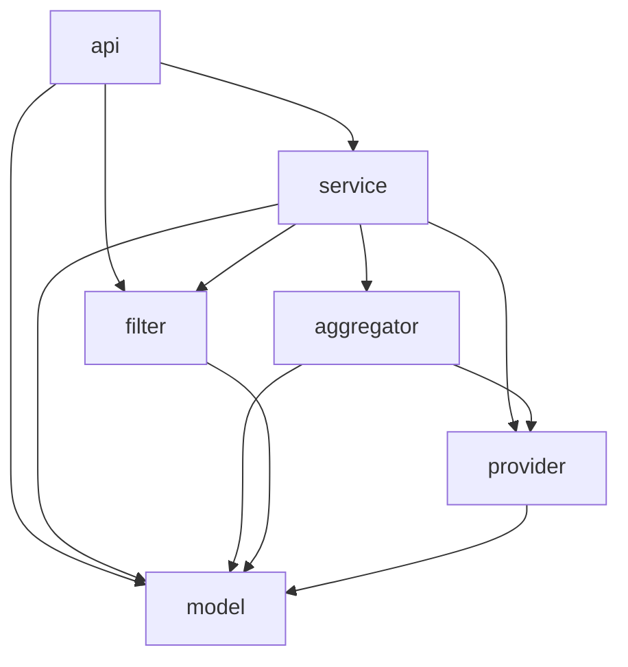
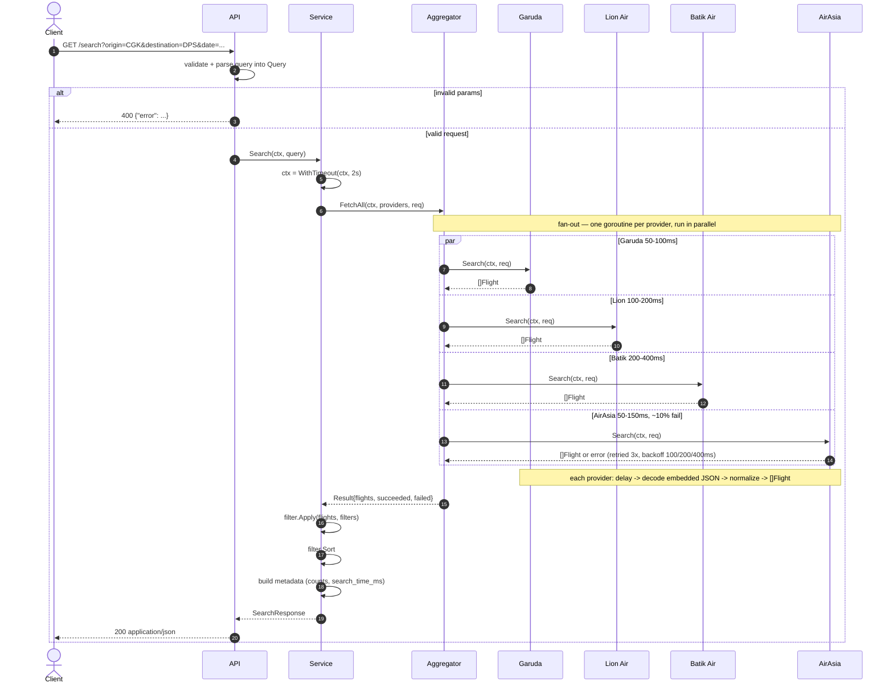

# Flight Search & Aggregation System

Aggregates flights from four mock airline providers (Garuda Indonesia, Lion Air, Batik Air, AirAsia) into one normalized, filterable, sortable, ranked result set, served over HTTP.

Go 1.26+, standard library only, no external dependencies.

Implemented Functionality:
1. Flight Data Aggregation
2. Search, Filter & Sorting Capability
3. Best Value Ranking (based on price, duration, and stops)
4. Data Inconsistency Handling
5. Provider Retry with Exponential Backoff
6. IDR Formatted Price Display
7. Parallel Provider Calls

---

## Quick setup

**1. Install Go 1.26+** — the only prerequisite.

- Download the official installer from <https://go.dev/dl/>, or use a package manager:
  - **macOS:** `brew install go`
  - **Windows:** `winget install GoLang.Go` (or `choco install golang`)
  - **Linux:** download the tarball and extract to `/usr/local`, then add
    `/usr/local/go/bin` to your `PATH`:
    ```bash
    curl -LO https://go.dev/dl/go1.26.0.linux-amd64.tar.gz
    sudo rm -rf /usr/local/go && sudo tar -C /usr/local -xzf go1.26.0.linux-amd64.tar.gz
    export PATH=$PATH:/usr/local/go/bin   # add to ~/.bashrc or ~/.profile to persist
    ```
- Verify: `go version` should print `go1.26` or newer.

**2. Clone, test, and run:**

```bash
git clone git@github.com:zakidevara/bookcabin-assessment.git
cd bookcabin-assessment          # the folder containing go.mod

go test ./...                    # run the test suite
go build ./... && go vet ./...   # compile + static checks
go run ./cmd/server              # start the HTTP API on :8080
go run ./cmd/server -demo        # instead: one sample search, print JSON, exit
go run ./cmd/server -addr :9000  # custom port
```


## HTTP API

### `GET /search`

All parameters are query-string values.

| Parameter | Required | Default | Description |
|---|---|---|---|
| `origin` | Yes | — | Origin airport code, e.g. `CGK`. |
| `destination` | Yes | — | Destination airport code, e.g. `DPS`. |
| `date` | Yes | — | Departure date, `YYYY-MM-DD`. |
| `passengers` | No | `1` | Positive integer. |
| `cabin` | No | `economy` | Cabin class. |
| `sort` | No | `best_value` | One of `best_value`, `price_asc`, `price_desc`, `duration_asc`, `duration_desc`, `depart_asc`, `arrive_asc`. |
| `min_price` | No | — | Minimum price, IDR. |
| `max_price` | No | — | Maximum price, IDR. |
| `max_stops` | No | — | Maximum number of stops (`0` = direct only). |
| `max_duration` | No | — | Maximum total duration, in minutes. |
| `airlines` | No | — | Comma-separated airline codes or names, e.g. `GA,JT`. |

**Responses**

| Status | Body | When |
|---|---|---|
| `200 OK` | `SearchResponse` (below) | Success — even if some providers failed (see `metadata`). |
| `400 Bad Request` | `{"error":"..."}` | Missing or invalid parameters. |
| `405 Method Not Allowed` | `{"error":"..."}` | Any method other than GET. |

The request context is threaded through, so a dropped connection cancels the
search; the server drains in-flight requests on SIGINT/SIGTERM.

**Example requests**

```bash
# default (best-value ranking)
curl "localhost:8080/search?origin=CGK&destination=DPS&date=2025-12-15"

# shortest first, direct only, under Rp1.3M, Garuda only
curl "localhost:8080/search?origin=CGK&destination=DPS&date=2025-12-15&sort=duration_asc&max_stops=0&max_price=1300000&airlines=GA"
```

**Sample response**:

```json
{
  "search_criteria": {
    "origin": "CGK",
    "destination": "DPS",
    "departure_date": "2025-12-15",
    "passengers": 1,
    "cabin_class": "economy"
  },
  "metadata": {
    "total_results": 13,
    "providers_queried": 4,
    "providers_succeeded": 4,
    "providers_failed": 0,
    "search_time_ms": 237,
    "cache_hit": false
  },
  "flights": [
    {
      "id": "QZ532_AirAsia",
      "provider": "AirAsia",
      "airline": { "name": "AirAsia", "code": "QZ" },
      "flight_number": "QZ532",
      "departure": {
        "airport": "CGK",
        "city": "Jakarta",
        "datetime": "2025-12-15T19:30:00+07:00",
        "timestamp": 1765801800
      },
      "arrival": {
        "airport": "DPS",
        "city": "Denpasar",
        "datetime": "2025-12-15T22:10:00+08:00",
        "timestamp": 1765807800
      },
      "duration": { "total_minutes": 100, "formatted": "1h 40m" },
      "stops": 0,
      "price": { "amount": 595000, "currency": "IDR", "formatted": "Rp595.000" },
      "available_seats": 72,
      "cabin_class": "economy",
      "aircraft": null,
      "amenities": [],
      "baggage": { "carry_on": "Cabin baggage only", "checked": "Additional fee" }
    }
  ]
}
```

> A provider that fails or times out is non-fatal: it's counted in
> `metadata.providers_failed` and the search returns the rest. Each flight also
> currently carries a debug `score` field (used for best-value ranking tuning),
> intended to be hidden in production.

---

## Architecture

```
cmd/server        entrypoint: wires providers + service, serves HTTP (or -demo)
internal/
  model           the common data models
  provider        Provider interface + one file per provider/airline + raw→unified mapping
    data/         embedded mock JSON responses (//go:embed)
  aggregator      concurrent fan-out, retry + backoff, timeout, success/fail counts
  filter          filtering, sorting, best-value ranking
  service         orchestration: aggregate → filter → rank → respond
  api             HTTP adapter over the service
  money           IDR currency formatting
```

Data flows one direction. A provider decodes its own raw JSON into a private
struct, maps it into `model.Flight`, and from that point nothing downstream
knows which airline a flight came from. The dependency arrows point inward:
`api → service → {aggregator, filter} → provider → model`.

### Package dependencies




### Request flow




---

## Key Design Decisions

### Flight Data Model Normalization
In order to make it easier for the aggregator to do processing (filtering, sorting, caching), the various data model from different providers is normalized into a standardized set of structs

- Every provider normalizes its flight data model into a single standardized set of structs (`Flight`, `Endpoint`,
`Baggage`…).
- Each provider implement an interface `Provider` to implement the `Name()` and `Search(ctx, req) ([]Flight, error)` function.

### Parallel Processing per Provider

- Implemented parallel processing using goroutine to run `Search` for each provider at the same time, minimizing latency on each search request.
- Enforced a global timeout and maximum 3 retries each provider with 100/200/400ms backoff.
- Partial failure handling: failure in one `Provider` doesn't affect the others.

### Best-Value Ranking

Best-value ranking uses 3 parameter with different weight: price (50%), flight duration (30%), and number of stops (20%). Each parameter is normalized per result set, so the score of each flight is relevant to other flight in the same result.

### Data Inconsistency Handling

| Inconsistency | Handling |
|---|---|
| Different envelopes (`status`/`code`/`success`, `flights`/`results`/`data.*`) | Per-provider typed structs |
| Offsets `+07:00` / `+0700` / none + IANA zone | Three explicit parse strategies |
| Durations as decimal hours / `"1h 45m"` / minutes | Ignored; recomputed from timestamps |
| Stops as bool / count / `segments` | Normalized to an integer; segments win |
| GA315 mislabelled direct-to-SUB | Segments resolve true DPS destination + 1 stop |
| Missing aircraft / amenities / city | `null` pointer / `[]` / airport lookup |
| Baggage as weight / pieces / prose | Structured `BaggageAllowance` |
| Buggy sample timestamps (year 2024) | Recomputed, sample treated as illustrative |

## Not implemented yet (ranked by highest priority)

1. **Caching.** Ideally, fetched flight result should be stored in a cache to remove tight coupling to the provider & improve our system's performance. We can serve stale data while cache refresh is triggered. Its a tradeoff between data freshness vs performance & availability.
2. **Request coalescing** To handle cache stampede if the cache key expires at the same time. Request coalescing will group identical request into one so that the upstream will receive less load.
3. **Per-provider rate limiting** via a token-bucket decorator.
4. **Circuit breaker** for sustained provider outages.
5. **Round-trip / multi-city.** 
